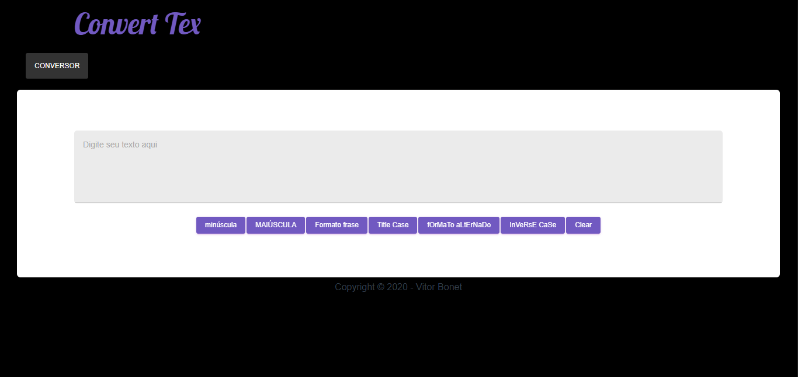

<h1>
  
</h1>

# Convert Tex

## Indice

  - [Sobre](#-sobre)
  - [Tercnologias Utilizadas](#-tecnologias-utilizadas)
  - [Como baixar o projeto](#-como-baixer-o-projeto)

---

### 📜 Sobre

  **Convert Tex** é uma aplicação Front-end para você converter seus textos e adequa-los do modo que você desejar.

---

  ### 💻 Tecnologias utilizadas

  O projeto foi desenvolvido utilizando as sequintes tecnologias.

  - [ReactJS](https://pt-br.reactjs.org/)


---
  ### 🖨 Como baixar o projeto

  ```bash

    # Clonar o repositório
    $ git clone https://github.com/VitorBonet/ConvertTex.git

    #Entrar no diretório
    $ cd ConvertTex

    # Intalar as dependências
    $ yarn install


    # Iniciar o projeto
    $ yarn start
  ```
---

Desenvolvido por Vitor Bonet 🏄‍♂️
